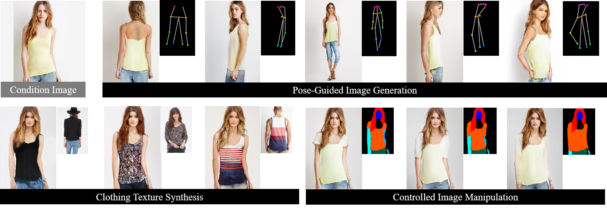

# person_generation_spt



### Unsupervised Person Image Generation with Semantic Parsing Transformation <br>(CVPR 2019, oral).

[Sijie Song](https://sijiesong.github.io/), [Wei Zhang](https://wzhang34.github.io/), [Jiaying Liu](http://icst.pku.edu.cn/struct/people/liujiaying.html), [Tao Mei](https://taomei.me/)

Project page: http://39.96.165.147/Projects/SijieSong_cvpr19/CVPR19_ssj.html

Check our our [paper](<https://arxiv.org/abs/1904.03379> )  and  [supplementary](<http://39.96.165.147/Projects/SijieSong_cvpr19/files/supp.pdf>) here.

### Prerequisites

* Python 2 (Python 3 should also work, but needs some modification)
* Pytorch >= 0.4.0
* opencv-python
* Numpy
* Scipy
* Pandas
* Skimage

### Getting started

A demo model is given for appearance generation.  We provide some samples in "./imgs", the parsing maps are in "./parsing". 

* Clone this repo:

```
git clone https://github.com/SijieSong/person_generation_spt.git

cd person_generation_spt
```

* Download pre-trained models from [Google Drive](https://drive.google.com/file/d/1261KP99IVV6kTy6cQ3nbUuqc8ZG32jrV/view?usp=sharing), put ./demo_model under ./checkpoints

* Quick testing (modify the gpu_id in ./scripts/test_demo.sh if needed)

```
bash ./scripts/test_demo.sh
```

* Check the results in ./results/demo_test (source image | target pose (groud truth) | output)

  

  

### Citation

If you use this code for your research, please cite our paper:

```
@inproceedings{song2019unsupervised,
  title={Unsupervised Person Image Generation with Semantic Parsing Transformation},
  author={Song, Sijie and Zhang, Wei and Liu, Jiaying and Mei, Tao},
  booktitle = {Proc.~IEEE Conference on Computer Vision and Pattern Recognition},
  year={2019}
}
```

### Related projects

* [CycleGAN and pix2pix in PyTorch](<https://github.com/junyanz/pytorch-CycleGAN-and-pix2pix>)
* [pose-gan](<https://github.com/AliaksandrSiarohin/pose-gan>)
* [LIP-SSL](<https://github.com/Engineering-Course/LIP_SSL>)

### Contact

Sijie Song  ssj940920 AT pku.edu.cn

